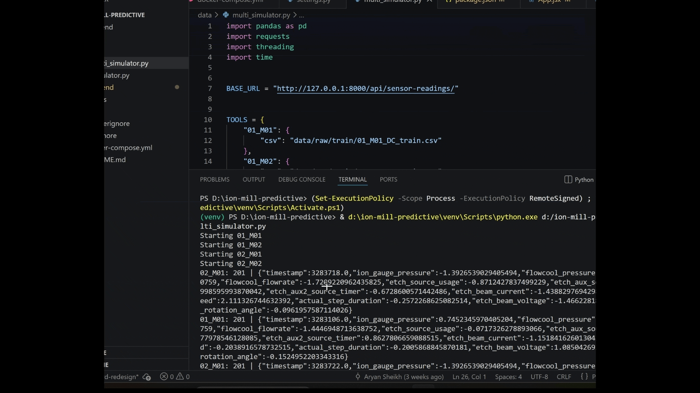
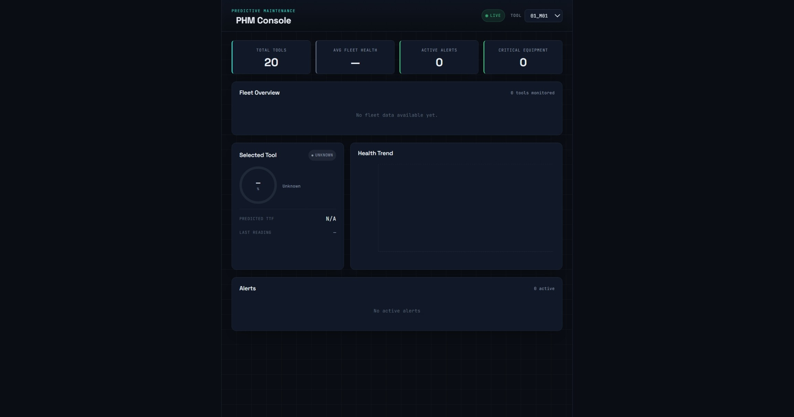

# Ion Mill Predictive Maintenance System
# Ion Mill Predictive Maintenance System


A full-stack predictive maintenance platform built using the PHM 2018 Data Challenge dataset. The system continuously ingests industrial ion mill telemetry, performs anomaly detection and Remaining Useful Life (RUL) estimation, stores telemetry in PostgreSQL, and visualizes equipment health through a React dashboard, and is fully containerized using Docker.

---

## Live Dashboard Demo (After Running 4 Machines)

<p align="center">  </p>

## Dashboard Overview (Before Running Any Machine)

<p align="center">  </p>

---

## Overview

Industrial ion milling equipment generates large volumes of sensor telemetry during operation. Unexpected failures can lead to costly downtime, production losses, and increased maintenance costs.

This project combines machine learning, backend engineering, containerization, and data visualization to create an end-to-end predictive maintenance platform capable of monitoring multiple tools simultaneously and estimating equipment degradation in real time.

---

## Key Features

### Fleet Monitoring

* Monitor multiple ion mill tools simultaneously
* Compare equipment health across the fleet
* Identify tools requiring maintenance attention
* View real-time operational status

### Anomaly Detection

* Isolation Forest based anomaly detection
* Real-time anomaly scoring
* Automated health score generation
* Early warning alerts for abnormal behaviour

### Remaining Useful Life Prediction

* Time-to-Failure (TTF) estimation
* Machine-aware predictive model
* Fleet-wide degradation modeling
* Maintenance planning support

### Telemetry Ingestion

* Concurrent multi-tool simulation
* Streaming industrial telemetry
* Historical sensor storage in PostgreSQL

### Containerized Deployment

* Dockerized React frontend
* Dockerized Django backend
* Dockerized PostgreSQL database
* One-command deployment with Docker Compose

---

## System Architecture

```text
PHM 2018 Dataset
        │
        ▼
Multi-Tool Telemetry Simulator
        │
        ▼
Django REST API
        │
        ├── PostgreSQL Storage
        ├── Isolation Forest Anomaly Detection
        └── TTF Prediction Engine
        │
        ▼
React Fleet Dashboard
        │
        ▼
Maintenance Engineers
```

---

## Technology Stack

### Frontend

* React
* Vite
* Axios
* Recharts

### Backend

* Django
* Django REST Framework

### Database

* PostgreSQL

### Machine Learning

* Scikit-learn
* Isolation Forest
* HistGradientBoostingRegressor
* Pandas
* NumPy

### Deployment

* Docker
* Docker Compose

---

## Dataset

This project uses the PHM 2018 Data Challenge dataset containing telemetry collected from industrial ion milling equipment.

Example telemetry signals include:

* Ion Gauge Pressure
* Flowcool Pressure
* Flowcool Flowrate
* Etch Beam Voltage
* Etch Beam Current
* Rotation Speed
* Source Usage
* Auxiliary Source Timers
* Process Duration

The dataset also provides:

* Failure labels
* Time-to-Failure targets
* Tool identifiers
* Process metadata

---

## Machine Learning Pipeline

### Anomaly Detection

An Isolation Forest model monitors incoming telemetry and identifies abnormal operating conditions.

Outputs:

* Anomaly Score
* Health Score
* Anomaly Flag

### Remaining Useful Life Prediction

A fleet-wide HistGradientBoostingRegressor model predicts Time-to-Failure using sensor telemetry and machine-specific context.

Features used:

* Etch Source Usage
* Auxiliary Source Timers
* Etch Beam Current
* Flowcool Pressure
* Rotation Speed
* Step Duration
* Ion Gauge Pressure
* Etch Beam Voltage
* Rotation Angle
* Machine Identifier

Outputs:

* Predicted Time-to-Failure
* Remaining Useful Life Estimate

---

## Model Evaluation

Several models were evaluated during development.

| Model                             | Dataset Scope |     MAE | Model Size |
| --------------------------------- | ------------- | ------: | ---------: |
| Random Forest (Baseline)          | Single Tool   |  ~1.29M |     491 MB |
| Random Forest (Extended Features) | Single Tool   |    ~295 |     8.9 GB |
| HistGradientBoosting              | Single Tool   |  ~7,337 |     726 KB |
| Production HistGradientBoosting   | 14 Tools      | ~38,896 |     730 KB |

The final deployment model was selected based on scalability, inference speed, deployment efficiency, and fleet-wide generalization performance.

---

## API Endpoints

### Equipment List

```http
GET /api/equipment/
```

### Equipment Health

```http
GET /api/equipment/{id}/health/
```

### Recent Readings

```http
GET /api/equipment/{id}/readings/
```

### Fleet Health

```http
GET /api/fleet-health/
```

### Alerts

```http
GET /api/alerts/
```

### Sensor Data Ingestion

```http
POST /api/sensor-readings/
```

---

## Running with Docker

### Build

```bash
docker compose build
```

### Start

```bash
docker compose up
```

### Stop

```bash
docker compose down
```

---

## Current Capabilities

* Multi-tool monitoring
* Fleet health visualization
* Anomaly detection
* Health score generation
* Fleet-wide TTF prediction
* Historical telemetry storage
* Concurrent telemetry simulation
* PostgreSQL persistence
* Containerized deployment

---

## Future Improvements

* Failure-specific prediction models
* Explainable AI dashboards
* Real-time streaming infrastructure
* Cloud deployment
* Authentication and access control
* Advanced maintenance scheduling
* Fleet-level analytics

---

## Author

Aryan Sheikh

MIT Manipal

B.Tech Computer Science (AI & ML)
